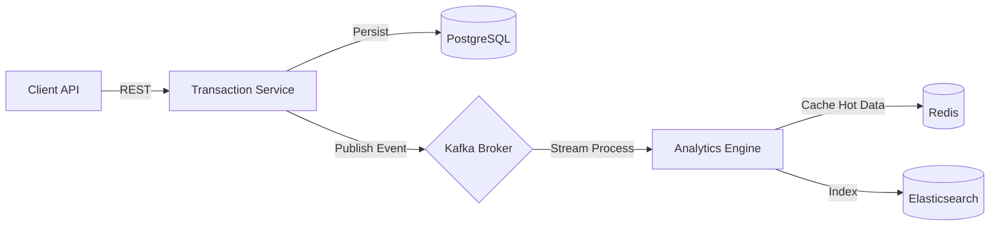

# OmniAnalytic - Real-time Transaction Analytics Platform

OmniAnalytic is a high-performance backend service designed to ingest, process, and analyze transaction data in real-time. It demonstrates a modern microservices architecture suitable for high-throughput financial applications.

## 🚀 Tech Stack & Key Concepts (Senior Level)

This project is built to showcase advanced Java & Spring Boot capabilities:

*   **Spring IoC & Core**: Clean architecture with Dependency Injection.
*   **Java Stream API**: Functional programming style for data transformation pipelines.
*   **Advance Native SQL**: Complex reporting using PostgreSQL Window Functions (`DENSE_RANK`, CTEs).
*   **Containerization**: Full Docker support with `docker-compose` for all infrastructure dependencies.
*   **Event-Driven Architecture**: Kafka for asynchronous event propagation and decoupling.
*   **Stream Processing**: Kafka Streams (Ready) for real-time aggregation.
*   **Caching & NoSQL**: Redis for high-speed caching and Elasticsearch for full-text search capabilities.

## 🏗 Architecture Overview



## 🛠 Prerequisites

*   Java 17+
*   Docker & Docker Compose
*   Maven 3.8+

## 🏃‍♂️ How to Run

1.  **Start Infrastructure**
    Spin up PostgreSQL, Kafka, Zookeeper, Redis, and Elasticsearch:
    ```bash
    docker-compose up -d
    ```

2.  **Build the Application**
    ```bash
    mvn clean install
    ```

3.  **Run the Application**
    ```bash
    mvn spring-boot:run
    ```

## 💡 Key Features Implementation

### 1. Advanced SQL Reporting
Located in `TransactionRepository.java`, we utilize native SQL window functions to calculate merchant rankings efficiently without loading all data into memory.

### 2. Reactive-style Ingestion
The `TransactionService.java` uses Java Streams to filter, map, and process transaction batches in a functional style, ensuring readability and maintainability.

### 3. Infrastructure as Code
The `docker-compose.yml` is production-ready, including configuration for Kafka listeners and Elasticsearch discovery modes.

## 🔮 Future Roadmap

*   Implement Kafka Streams topology for real-time fraud detection.
*   Add Redis caching for merchant configuration lookups.
*   Integrate Elasticsearch for transaction search API.
